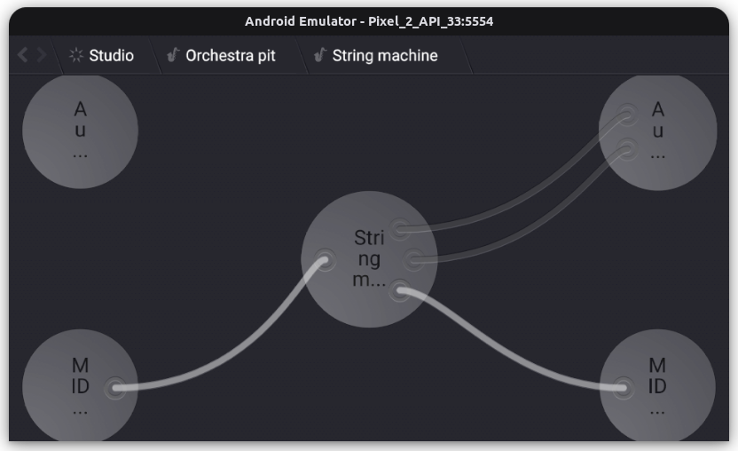

It is an experimental [aap-juce](https://github.com/atsushieno/aap-juce) port of [Helio Workstation](https://github.com/helio-fm/helio-workstation).

It seems to load AAPs on the plugin list, but not much further so far.

## Licensing notice

Helio Workstation is released under the GPLv3 license. There isn't really a lot of sources that can claim my copyright in this repo.

