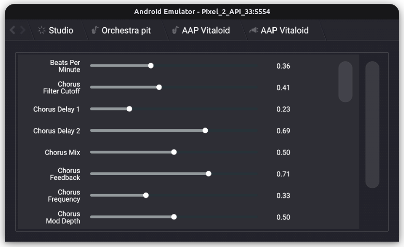

## What is this?

It is an experimental [aap-juce](https://github.com/atsushieno/aap-juce) integration into [Helio Workstation](https://github.com/helio-fm/helio-workstation).

Helio Workstation is a JUCE-based DAW, and aap-juce-helio adopts aap-juce hosting implementation. Most importantly, Helio Workstation supports Android to some extent, therefore the changes in this build is very trivial.

Yet, JUCE itself has various bugs in Android Dalvik integration to get AAP working enough, and we still need handful of JUCE patches.

## Current status:

See helio-workstation on Android playing LV2 String Machine in action: https://imgur.com/a/Hh91JAI (audio quality is horrible yet)

Some highlight screenshots from AAP 0.7.5-pre:

| subject | sshot |
|-|-|
| plugin listing |  |
| plugin routing (String Machine) |  |
| plugin parameters (Vitaloid, default GUI) |  |

## Licensing notice

Helio Workstation is released under the GPLv3 license.

aap-juce is released under the GPLv3 license.

There isn't really a lot of sources that can claim my copyright in this repo.
